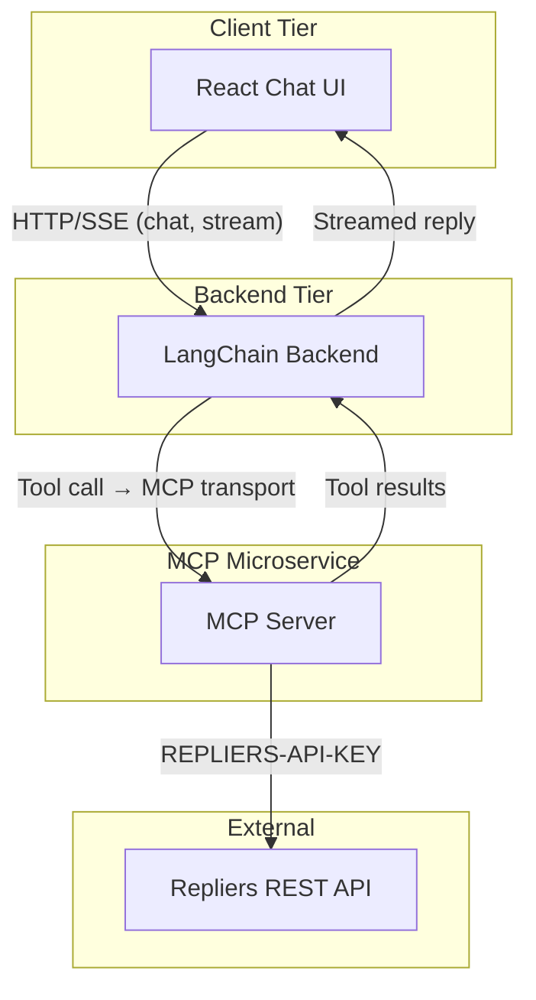
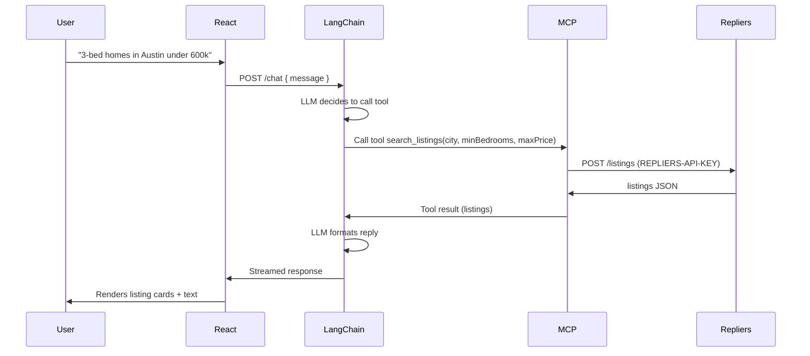

# Agent-Driven Real Estate Full Stack — Architecture & Implementation Plan

## 1. Full System Architecture



- **Frontend**: React SPA; single entry point is the chat UI. Communicates only with the LangChain backend (REST + optional SSE for streaming).
- **LangChain backend**: Orchestrator. Receives user messages, runs the LLM agent with tool-calling, and "calls" tools by communicating with the MCP server (no direct Repliers calls).
- **MCP server**: Standalone Node.js service. Exposes MCP tools (e.g. `search_listings`, `get_listing`) that internally call Repliers (POST/GET listings). Holds the Repliers API key; backend does not.
- **Repliers**: External REST API; auth via `REPLIERS-API-KEY` header (see [Repliers API](https://docs.repliers.io/reference/getting-started-with-your-api)).

---

## 2. Data Flow



- **Request path**: User → React → LangChain (body/query). LangChain runs the agent; when the model emits a tool call, the backend invokes the corresponding MCP tool.
- **MCP invocation**: Backend uses an MCP client (stdio or Streamable HTTP) to call tools by name with arguments; MCP server executes the tool, calls Repliers, returns structured result.
- **Response path**: Tool result → LangChain → LLM generates final answer → streamed (or single) response to React → UI updates (message + optional listing cards).

---

## 3. Separation of Responsibilities

| Layer                 | Responsibility                                                                                                                                                                                              | Does *not*                                                       |
| --------------------- | ----------------------------------------------------------------------------------------------------------------------------------------------------------------------------------------------------------- | ---------------------------------------------------------------- |
| **MCP Server**        | Expose MCP tools that wrap Repliers (search, get listing). Own Repliers API key and all Repliers HTTP calls. Validate/normalize tool inputs; return stable JSON. Optional: rate limiting, response caching. | Expose chat, LLM, or user session logic. No OpenAI key.          |
| **LangChain Backend** | Session/chat API, prompt construction, LLM calls (OpenAI), tool-calling loop (decide when to call which tool), MCP client to invoke tools. Own OpenAI API key. Stream responses to frontend.                | Call Repliers directly; store or see Repliers API key.           |
| **Frontend**          | Chat UI (input, message list, typing/streaming). Call backend `/chat` (or similar). Render listing snippets/cards from agent output. Auth/session (e.g. cookie or token) if required.                       | Call MCP or Repliers; hold API keys; implement agent/tool logic. |

Boundary rule: **Repliers API key only in MCP server.** OpenAI key only in LangChain backend. Frontend only talks to the backend.

---

## 4. Monorepo Folder Structure

Use a **Node.js monorepo** with workspaces (e.g. `packages/` and optional `apps/`). Suggested layout:

```
real-estate-agent/
├── package.json                 # workspace root, scripts for all apps
├── pnpm-workspace.yaml          # or npm workspaces
├── .env.example                 # document vars (no secrets)
├── .gitignore
│
├── packages/
│   ├── mcp-repliers/            # MCP server (Repliers wrapper), JavaScript
│   │   ├── package.json
│   │   ├── src/
│   │   │   ├── index.js         # MCP server entry, register tools
│   │   │   ├── tools/
│   │   │   │   ├── searchListings.js
│   │   │   │   └── getListing.js
│   │   │   └── repliers/        # Repliers API client
│   │   │       ├── client.js
│   │   │       └── schemas.js   # JSDoc or plain validation
│   │   └── env: REPLIERS_API_KEY
│   │
│   ├── shared-schemas/          # Shared JS schemas/constants (listing shape, search params)
│   │   ├── package.json
│   │   └── src/
│   │       └── index.js
│   │
│   └── langchain-backend/       # LangChain + OpenAI agent, JavaScript
│       ├── package.json
│       ├── src/
│       │   ├── index.js         # Express/Fastify entry
│       │   ├── routes/
│       │   │   └── chat.js      # POST /chat, optional GET /chat/stream
│       │   ├── agent/
│       │   │   ├── agent.js     # createToolCallingAgent, bind MCP tools
│       │   │   └── mcpClient.js # MCP client → tool invoker
│       │   └── lib/
│       │       └── stream.js
│       └── env: OPENAI_API_KEY, MCP_SERVER_URL or MCP_CMD
│
├── apps/
│   └── web/                     # React.js chat frontend (Vite or CRA), no Next.js
│       ├── package.json
│       ├── vite.config.js       # or CRA
│       ├── index.html
│       └── src/
│           ├── main.jsx
│           ├── App.jsx
│           ├── components/
│           │   ├── Chat.jsx
│           │   ├── MessageList.jsx
│           │   ├── ListingCard.jsx
│           │   └── Input.jsx
│           ├── api/
│           │   └── chat.js      # fetch to backend
│           └── env: VITE_API_URL (backend URL)
│
└── docs/                        # optional: architecture, runbooks
    └── architecture.md
```

- **packages/mcp-repliers**: Single MCP server process (JavaScript); exposes tools that map to Repliers (e.g. search with `city`, `minBedrooms`, `maxPrice`, `page`, `resultsPerPage`).
- **packages/shared-schemas**: Shared JavaScript schemas/constants for listing shape and search params so MCP, backend, and frontend stay aligned (JSDoc or a small validation lib).
- **packages/langchain-backend**: HTTP server + agent + MCP client (JavaScript); no Repliers dependency.
- **apps/web**: React.js app (Vite or Create React App); only `VITE_API_URL` (backend); no MCP or Repliers URLs/keys. No Next.js.

---

## 5. Development Workflow

- **Tooling**: JavaScript everywhere (Node and React); no TypeScript. Use `pnpm` or `npm` workspaces; lint/format (ESLint/Prettier) at root.
- **Env**: Per-package `.env` (or root with overrides). `.env.example` at root listing:
  - `REPLIERS_API_KEY` (MCP only)
  - `OPENAI_API_KEY` (backend only)
  - `MCP_SERVER_URL` or `MCP_CMD` (backend)
  - `VITE_API_URL` (frontend, e.g. `http://localhost:4000`)
- **Run order**:
  1. Start MCP server (e.g. `pnpm --filter mcp-repliers dev`) — Streamable HTTP on a port or stdio.
  2. Start LangChain backend (e.g. `pnpm --filter langchain-backend dev`) — connects to MCP, listens e.g. 4000.
  3. Start React app (e.g. `pnpm --filter web dev`) — proxy or `VITE_API_URL` to backend.
- **Scripts**: Root `package.json` scripts such as `dev` (concurrently run MCP + backend + web), `build`, `test` (per package or root).
- **Testing**: Unit tests for MCP tools (mock Repliers), agent tests with mock MCP; E2E optional (Playwright) against local stack.

---

## 6. Production Scalability Considerations

- **MCP server**: Stateless; scale horizontally behind a load balancer. Use **Streamable HTTP** for production so the backend can call `https://mcp-service/` instead of a single stdio process.
- **LangChain backend**: Stateless per request; scale horizontally. Consider connection pooling or a small pool of long-lived MCP client connections if using a stateful transport.
- **Rate limits**: Repliers and OpenAI have rate limits. In MCP, add throttling/backoff for Repliers; in backend, throttle or queue OpenAI calls if needed.
- **Caching**: Optional response cache in MCP for repeated search params (e.g. short TTL in Redis) to reduce Repliers calls.
- **Streaming**: Use SSE or streaming HTTP from backend to frontend for better perceived latency; keep tool calls server-side.
- **Deployment**: Deploy MCP and backend as separate services (e.g. containers); frontend as static assets + CDN. Use env-based config (no hardcoded keys).

---

## 7. Security Considerations (API Key Isolation)

- **Repliers API key**: Only in MCP server env (e.g. `REPLIERS_API_KEY`). Backend and frontend never see it. In production, use a secret manager (e.g. AWS Secrets Manager, GCP Secret Manager) and inject into MCP process.
- **OpenAI API key**: Only in LangChain backend env. Not exposed to frontend or MCP.
- **Network**: Frontend → backend only (same-origin or CORS to backend). Backend → MCP on internal network (or authenticated server-to-server). MCP → Repliers over HTTPS.
- **MCP auth**: If MCP is HTTP, restrict to internal VPC or add auth (e.g. API key or mTLS) so only the backend can call it.
- **Input validation**: MCP tools should validate and sanitize inputs (e.g. Zod or Joi in JavaScript); backend should validate chat payloads and optional auth/session tokens.
- **.env**: Never commit `.env`; `.env.example` documents variable names only (no values).

---

## Implementation Notes

- **MCP transport**: Prefer **Streamable HTTP** for production (scalable, no process coupling). Use stdio for local dev if desired (backend spawns MCP process).
- **Repliers**: Search = POST `https://api.repliers.io/listings` with query/body params; single listing = GET `https://api.repliers.io/listings/{mlsNumber}`; auth = `REPLIERS-API-KEY` header.
- **LangChain**: Use `createToolCallingAgent` (or equivalent) with a tool that wraps your MCP client (each MCP tool becomes one LangChain tool). Map LLM tool names to MCP tool names and arguments. Use LangChain JS (not TS-specific APIs).
- **Frontend**: React.js with Vite or Create React App (no Next.js). Parse agent output (or a structured block in the stream) to render listing cards; keep a single source of truth for "listings" from tool results.

This gives you a clear architecture, data flow, boundaries, monorepo layout, dev workflow, scalability approach, and security model for the agent-driven real estate stack.
